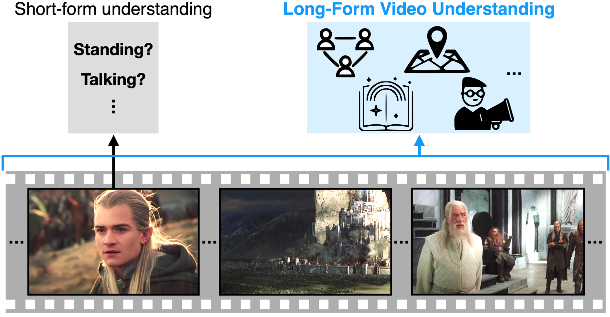

# Towards Long-Form Video Understanding  <br>
[Chao-Yuan Wu](https://chaoyuan.org/), 
[Philipp Kr&auml;henb&uuml;hl](http://www.philkr.net/),
CVPR 2021  
## [[Paper]](https://chaoyuan.org/papers/lvu.pdf) [[Project Page]](https://chaoyuan.org/lvu) [[Dataset]](https://chaoyuan.org/lvu/lvu_1.0.tar.gz) ## 

<div align="center">
  
</div>

## Citation
```bibtex
@inproceedings{lvu2021,
  Author    = {Chao-Yuan Wu and Philipp Kr\"{a}henb\"{u}hl},
  Title     = {{Towards Long-Form Video Understanding}},
  Booktitle = {{CVPR}},
  Year      = {2021}}
```


## Overview
This repo implements Object Transformers for long-form video understanding.


## Getting Started
Please organize `data/` as follows
```
data
|_ ava
|_ features
|_ instance_meta
|_ lvu_1.0
```
`ava`, `features`, and `instance_meta` could be found at [this Google Drive folder](https://drive.google.com/drive/folders/1v4iSmYL7SDxTKYkVokXUIOUOHj5BbszW?usp=sharing).
`lvu_1.0` can be found at [here](https://chaoyuan.org/lvu/lvu_1.0.tar.gz).

Please also download pre-trained weights at [this Google Drive folder](https://drive.google.com/drive/folders/1v4iSmYL7SDxTKYkVokXUIOUOHj5BbszW?usp=sharing) and put them in `pretrained_models/`.

## Pre-training
```
bash run_pretrain.sh
```
This pretrains on a small demo dataset `data/instance_meta/instance_meta_pretrain_demo.pkl` as an example. Please follow its file format if you'd like to pretrain on a larger dataset (e.g., latest full version of MovieClips).

## Training and evaluating on AVA v2.2
```
bash run_ava.sh
```
This should achieve 31.0 mAP.

## Training and evaluating on LVU tasks
```
bash run.sh [1-9]
```
The argument selects a task to run on. Please see `run.py` for details.

## Acknowledgment
This implementation largely borrows from [Huggingface Transformers](https://github.com/huggingface/transformers). Please consider citing it if you use this repo.
